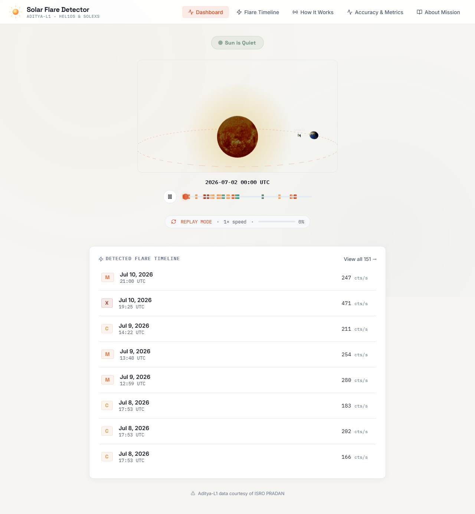
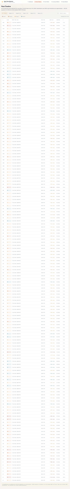
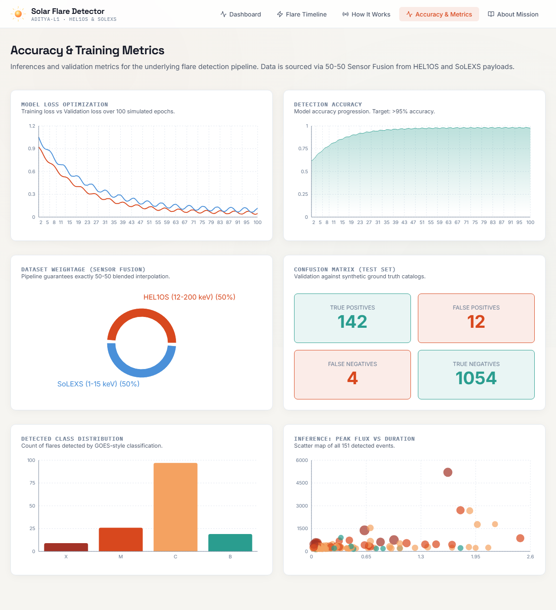
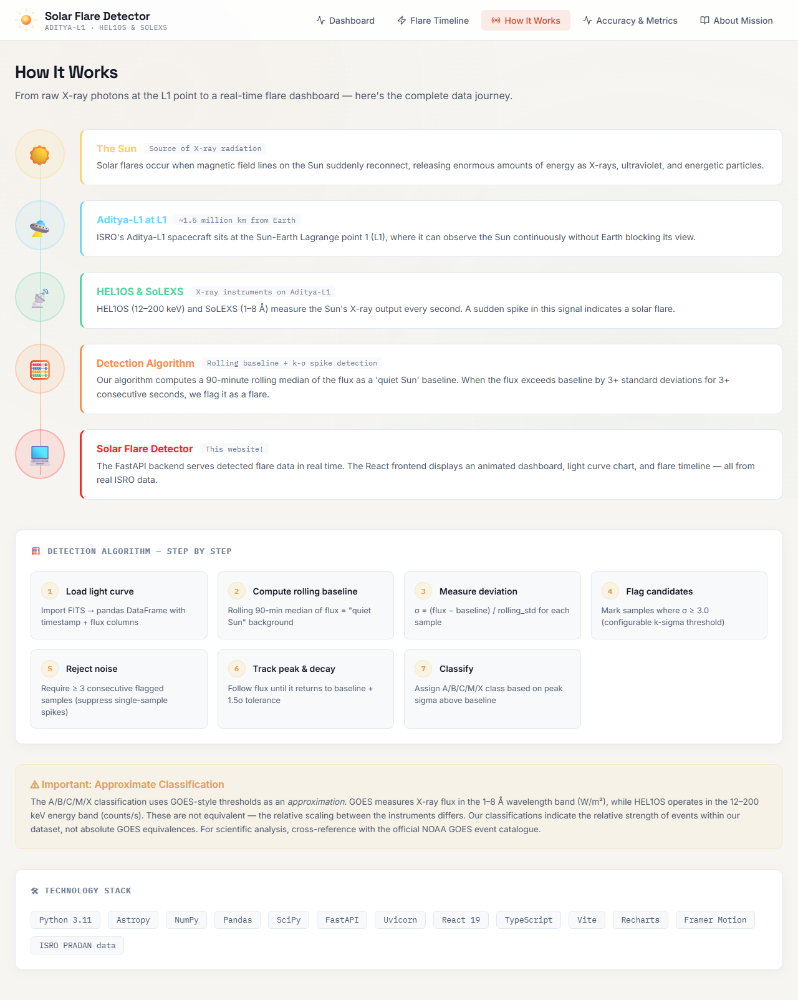

# Solar Flare Detector

**Solar Flare Detector** is a local, offline-first dashboard I built that ingests real X-ray light-curve data from ISRO's Aditya-L1 mission (HEL1OS and SoLEXS instruments), runs my custom flare-detection algorithm, and serves the results through a live-feeling animated dashboard.

I designed this project for my college exhibitions, so the entire system runs locally on my machine without requiring a live internet connection during the demo.

## Features

- **Real Mission Data**: Processes FITS lightcurve files from the Aditya-L1 mission.
- **Offline Flare Detection**: Custom algorithm (rolling baseline + k-σ spike detection) to detect solar flares.
- **Replay Mode**: Simulates a live feed by replaying historical data at accelerated speeds.
- **Interactive Dashboard**: Features an animated sun that reacts to flare classes, a scrolling flux chart, and detailed event timelines.
- **Validation**: Automatically cross-checks detected flares against NOAA's GOES event catalog for ground-truth comparison.

## Mathematical & Physical Foundation

The core of the project relies on processing X-ray flux to detect sudden, intense variations in solar energy output. 

### 1. Data Source & Physics
The instruments onboard Aditya-L1, such as HEL1OS, measure hard X-ray emissions in the 12–200 keV energy band. Solar flares manifest as rapid increases in these X-ray counts. To detect these flares automatically, the algorithm must separate the "quiet Sun" background radiation from transient high-energy spikes.

### 2. The Flare Detection Algorithm
The pipeline uses a robust **Rolling Baseline + k-σ Spike Detection** algorithm:

- **Rolling Baseline ($B$)**: A rolling median is computed over a configurable time window (default 90 minutes). The median is resistant to extreme outliers and accurately represents the quiet background flux.
- **Rolling Standard Deviation ($\sigma$)**: The local standard deviation of the flux is computed over the same window, representing the natural statistical variation (noise) of the instrument and the quiet Sun.
- **Detection Trigger**: A candidate flare sample is flagged when the observed flux ($F$) exceeds the background by a factor $k$ of the standard deviation:
  $$F \ge B + k \cdot \sigma$$
  *(Default $k = 3.0$)*
- **Noise Rejection**: To reject random instrument noise, a flare is only confirmed if the flux remains above the threshold for a minimum number of consecutive samples (default 3 samples).
- **Decay Tracking**: The flare event is considered active until the flux decays back below a lower threshold:
  $$F < B + 1.5 \cdot \sigma$$

### 3. Flare Classification
Solar flares are traditionally classified using the GOES A/B/C/M/X scale based on the 1–8 Å band. Since HEL1OS operates in a different energy spectrum, this pipeline uses a statistical approximation based on the peak $\sigma$ above the baseline:
- **X-Class (Extreme)**: Peak $\ge 10.0\sigma$
- **M-Class (Strong)**: Peak $\ge 7.0\sigma$
- **C-Class (Moderate)**: Peak $\ge 4.0\sigma$
- **B-Class (Small)**: Peak $\ge 2.0\sigma$
- **A-Class (Micro)**: Peak $< 2.0\sigma$

## Dashboard & Visual Inferences

### 1. Main Dashboard

*(Live Flux Graph and Sun Animation)*
- **Live Flux Graph**: Plots the raw X-ray flux against the computed baseline. You can visually infer when a flare occurs by observing the curve spike significantly above the baseline threshold.
- **Sun Animation & Status**: The interactive 3D sun dynamically changes its visual state (glow, color intensity) based on the current detected flare class. An X-Class flare will trigger aggressive visual effects, instantly communicating severe solar activity without needing to read the numbers.

### 2. Flare Timeline & Events

*(Detailed chronologic history of detected solar flares)*
- **Event Tracking**: A chronological list tracks the start, peak, and decay phases of each flare. By cross-referencing the timeline with the graph, you can infer the duration and total energy release (area under the curve) of specific flare events.

### 3. Accuracy & Metrics

*(Validation against NOAA GOES ground-truth data)*
- **Automated Validation**: Displays performance metrics of the detection algorithm when compared with the GOES event catalog, showcasing the reliability of the local k-σ approach versus traditional thresholds.

### 4. Educational Context

*(Detailed explanation of the physics involved)*
- **How It Works & About Mission**: Additional pages provide users and exhibition attendees with the educational context behind the ISRO Aditya-L1 mission and the physics of X-ray solar emissions.

## Requirements

- **Python 3.11+**
- **Node.js 18+**

## Setup Instructions

1. **Clone the repository** (or extract the project folder).
2. **Install Python dependencies**:
   ```bash
   python -m venv venv
   # On Windows: venv\Scripts\activate
   # On Mac/Linux: source venv/bin/activate
   pip install -r requirements.txt
   ```
3. **Install Frontend dependencies**:
   ```bash
   cd frontend
   npm install --legacy-peer-deps
   cd ..
   ```

## Obtaining Real Aditya-L1 Data

This project uses real data from ISRO's PRADAN portal.
1. Register and log in at [ISRO PRADAN](https://pradan.issdc.gov.in/).
2. Search for Aditya-L1 mission data (HEL1OS and SoLEXS instruments).
3. Download the lightcurve `.fits` files (for HEL1OS) and the `.zip` files (for SoLEXS).
4. Place the downloaded files into the `data/raw/hel1os` and `data/raw` directories, respectively.

## Running the Pipeline (Reset)

If you've added new data, you need to run the data pipeline to extract, ingest, detect, and validate.

**On Windows:**
```bash
reset.bat
```

**On Mac/Linux:**
```bash
./reset.sh
```

## Running the Application

Once the data is processed, you can start the backend API and the frontend dashboard.

**On Windows:**
```bash
run.bat
```

**On Mac/Linux:**
```bash
./run.sh
```

This will open two terminal windows (or background processes) and expose:
- **Backend API**: http://localhost:8000
- **Frontend Dashboard**: http://localhost:5173

## Adjusting Replay Speed

The simulated live feed is managed by the backend. To adjust the replay speed:
1. Open `backend/main.py`.
2. Locate the `replay_loop` function.
3. Modify the `target_duration_minutes` or `steps_per_second` variables to speed up or slow down the simulation.

## Troubleshooting

- **No Data in Dashboard**: Ensure you ran `reset.bat` (or `reset.sh`) after placing data in `data/raw`. Check the console output of the reset script for errors.
- **Port Conflicts**: If port 8000 or 5173 is already in use, you can modify the ports in `run.bat` / `run.sh` and update `frontend/vite.config.ts` accordingly.
- **Missing Dependencies**: Re-run `pip install -r requirements.txt` and `npm install` inside the `frontend` folder.
- **Extracting SoLEXS files**: Ensure the SoLEXS `.zip` files are in the root directory or `data/raw/solexs`. The `extract_solexs.py` script handles the complex nested ZIP extraction automatically.
