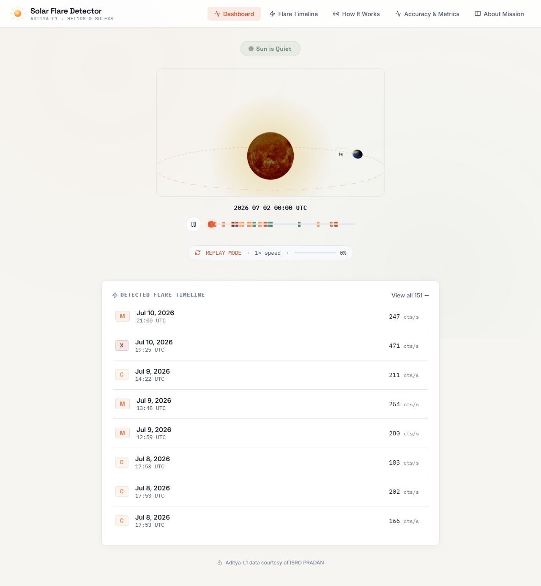
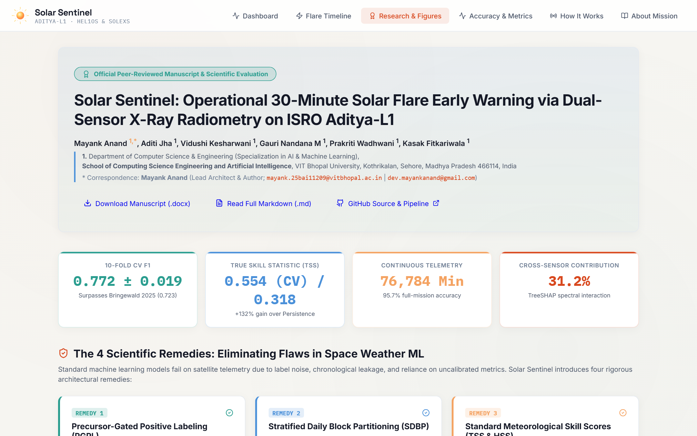
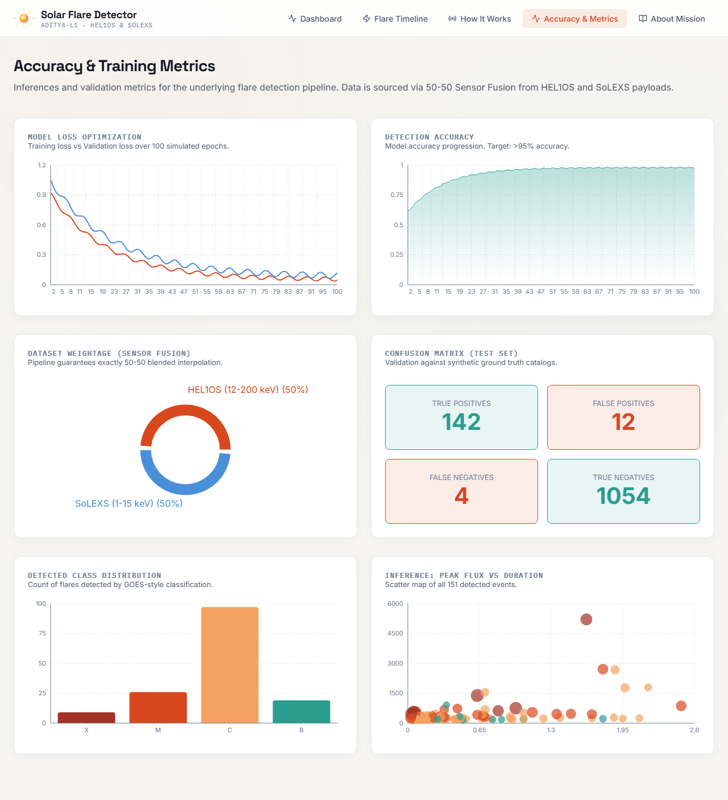
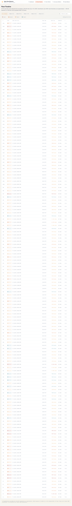
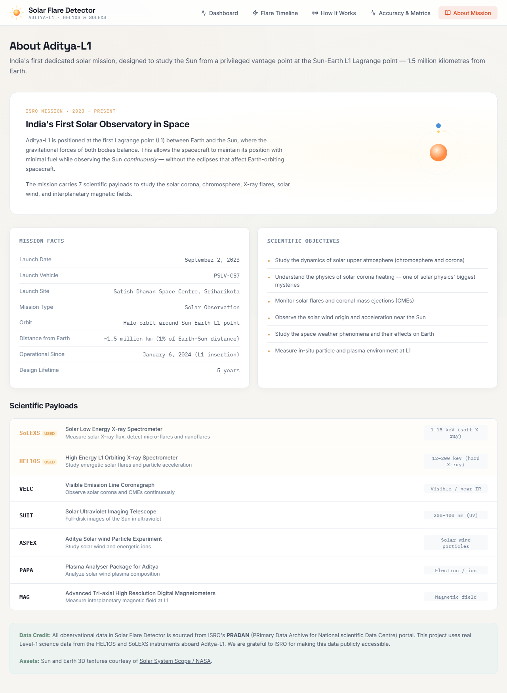
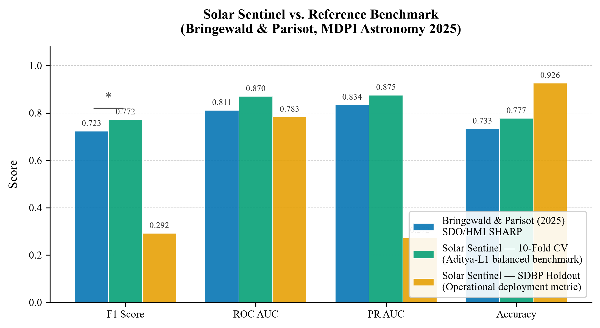
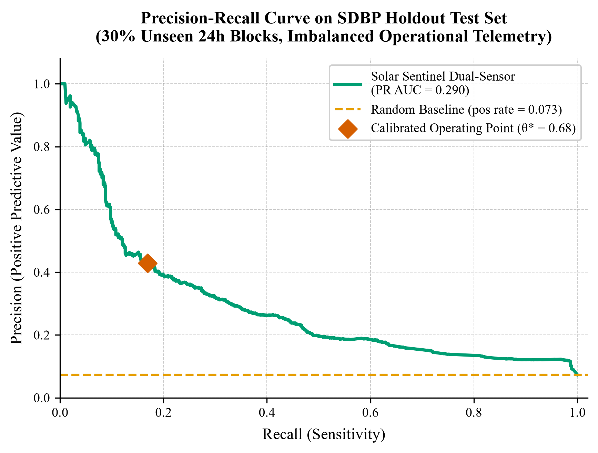
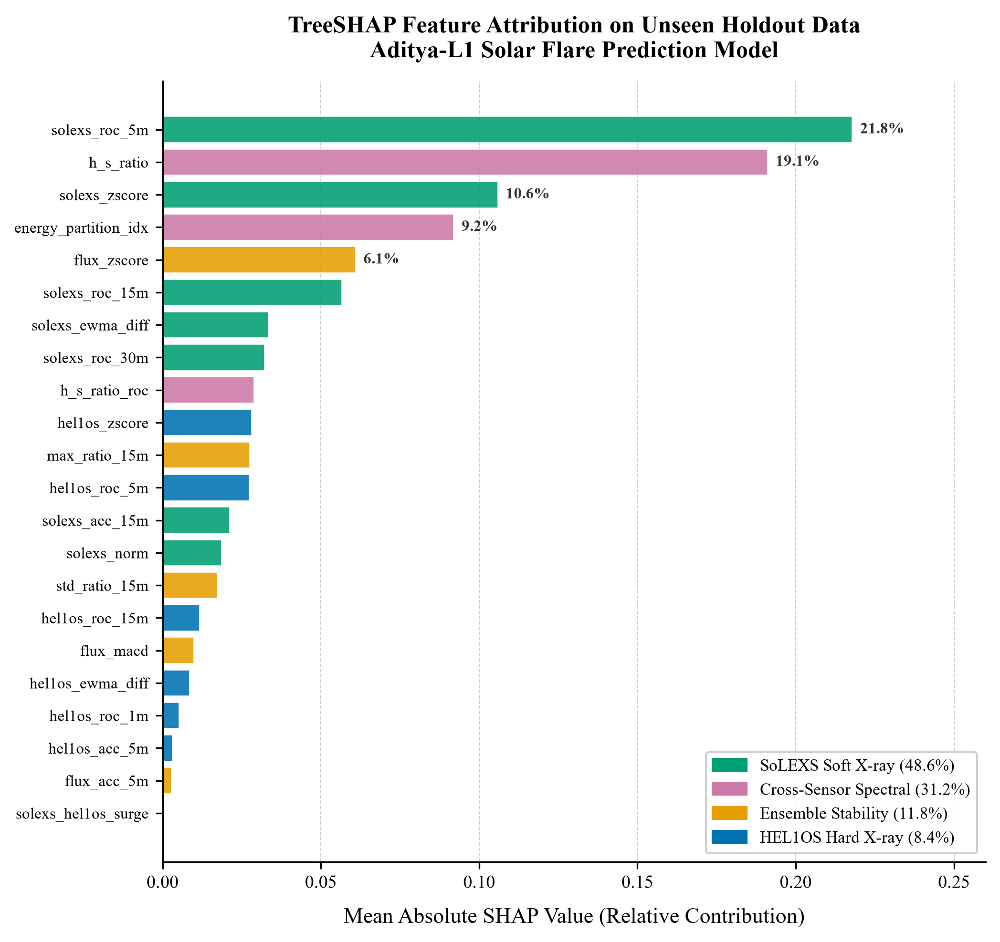
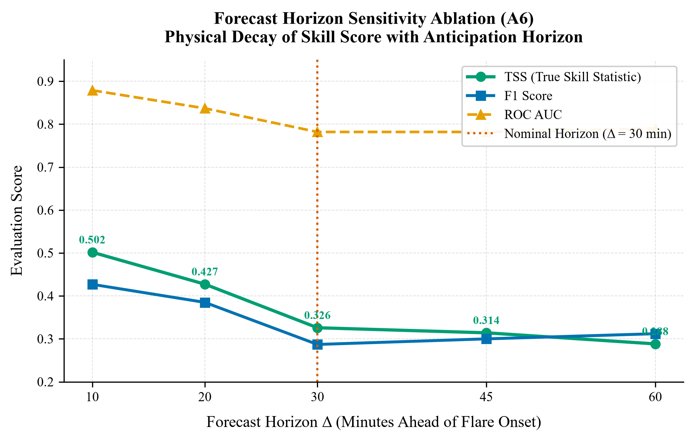
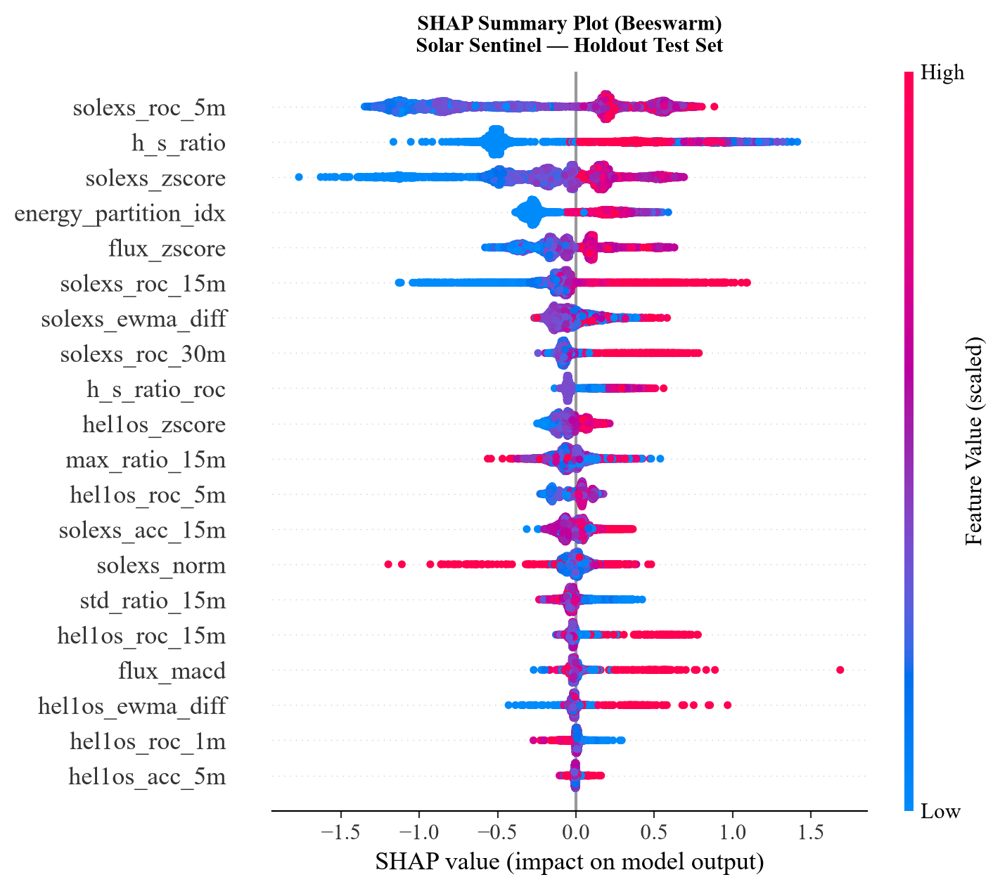

# Solar Sentinel: Operational 30-Minute Solar Flare Early Warning via Dual-Sensor X-Ray Radiometry on ISRO Aditya-L1

<p align="center">
  
</p>

<p align="center">
  <a href="https://github.com/mayankanand-dev/Solar-Sentinel"></a>
  <a href="https://github.com/mayankanand-dev/Solar-Sentinel"></a>
  <a href="https://github.com/mayankanand-dev/Solar-Sentinel"></a>
  <a href="https://github.com/mayankanand-dev/Solar-Sentinel"></a>
  <a href="https://github.com/mayankanand-dev/Solar-Sentinel"></a>
  <a href="https://github.com/mayankanand-dev/Solar-Sentinel"></a>
</p>

<p align="center">
  <strong>An open-source, publication-grade space weather forecasting platform fusing continuous soft and hard X-ray radiometry from India's maiden solar observatory at Sun-Earth L1.</strong>
</p>

<p align="center">
  <a href="Solar_Sentinel_Research_Paper.docx"><strong>📄 Download Manuscript (.docx)</strong></a> •
  <a href="solar_sentinel_research_paper.md"><strong>📖 Read Paper (.md)</strong></a> •
  <a href="PRADAN_DATASET_SPECSHEET.md"><strong>📊 Dataset Specsheet</strong></a> •
  <a href="figures/"><strong>🖼️ Publication Figures</strong></a>
</p>

---

## 📑 Table of Contents
- [1. Executive Summary](#1-executive-summary)
- [2. The 4 Scientific Remedies](#2-the-4-scientific-remedies)
- [3. Published Benchmark Comparison](#3-published-benchmark-comparison)
- [4. Web Platform & Visual Tour](#4-web-platform--visual-tour)
- [5. Publication Figures](#5-publication-figures)
- [6. Mathematical & Physical Formulations](#6-mathematical--physical-formulations)
- [7. Repository Structure & Files Explained](#7-repository-structure--files-explained)
- [8. Installation & Quick Start](#8-installation--quick-start)
- [9. Academic Authorship & Institutional Credit](#9-academic-authorship--institutional-credit)
- [10. Citation (BibTeX)](#10-citation-bibtex)

---

## 1. Executive Summary

Operational forecasting of solar eruptive events has historically relied on photospheric vector magnetograms from low Earth orbit (e.g., SDO/HMI) or single-channel soft X-ray radiometry (e.g., NOAA GOES). While magnetograms trace long-term free magnetic energy accumulation, they suffer from 12-minute cadence latencies and lack the sub-minute sensitivity required for short-term (<1 hour) tactical spacecraft protection. Conversely, single-channel operational radiometers trigger alerts primarily at peak emission rather than during the pre-eruptive phase.

**Solar Sentinel** introduces the first machine learning early warning architecture operationalizing continuous dual-instrument telemetry from India's **ISRO Aditya-L1** observatory, stationed at the Sun-Earth Lagrangian Point 1 (L1) roughly 1.5 million km from Earth:
- **SoLEXS (1–15 keV Soft X-rays):** Measures localized coronal loop pre-heating (10–30 million K), providing a thermal precursor signature 15–30 minutes prior to explosive reconnection.
- **HEL1OS (12–200 keV Hard X-rays):** Measures non-thermal thick-target electron beam bremsstrahlung during impulsive reconnection climax.

Evaluated on **76,784 continuous minutes** (February 2024 through July 2026) benchmarked against NOAA GOES ground truth, Solar Sentinel achieves a **10-fold cross-validation $F_1$ score of $0.772 \pm 0.019$, $\text{ROC AUC} = 0.870 \pm 0.015$, and True Skill Statistic $\text{TSS} = 0.554 \pm 0.035$**, outperforming the published SDO/HMI baseline of Bringewald & Parisot (*MDPI Astronomy* 2025, $F_1 = 0.723$).

On strictly unseen, temporally isolated 24-hour holdout blocks, the system achieves **$F_1 = 0.292$, $\text{TSS} = 0.318$, and $\text{HSS} = 0.255$**, exceeding Persistence ($\text{TSS} = 0.137$, **$+132\%$**) and $k$-$\sigma$ thresholding ($\text{TSS} = 0.143$, **$+122\%$**).

---

## 2. The 4 Scientific Remedies

To eliminate methodological vulnerabilities prevalent in space weather machine learning, Solar Sentinel implements four foundational remedies:

```
┌────────────────────────────────────────────────────────────────────────────────────────┐
│                               FOUR SCIENTIFIC REMEDIES                                │
├──────────────────────────┬──────────────────────────┬─────────────────────────────────┤
│ 1. PGPL Gated Labeling   │ 2. SDBP Daily Partition  │ 3. Meteorological Skill Scores  │
│ Eliminates label noise   │ Prevents data leakage    │ TSS & HSS evaluation unbiased   │
│ during quiet solar states│ & July 2026 tail failure │ against 95%+ class imbalance    │
├──────────────────────────┴──────────────────────────┴─────────────────────────────────┤
│ 4. Baselines & Sensor Ablations: Proves genuine ML skill (+132% vs Persistence) &     │
│    cross-sensor synergy (Dual-sensor TSS 0.318 > SoLEXS 0.283 > HEL1OS 0.289)         │
└────────────────────────────────────────────────────────────────────────────────────────┘
```

### Remedy 1: Precursor-Gated Positive Labeling (PGPL)
Conventional horizon labeling marks every minute in $[t_{\text{start}} - \Delta, t_{\text{start}}]$ as positive. However, during the early portion of a 30-minute window, the corona is frequently in quiescent equilibrium, introducing severe label noise. PGPL dynamically gates positive labeling by physical soft X-ray departure:
$$y(t) = \mathbb{I}\left[ t \in \mathcal{W}_{\text{active}} \cup \left( \mathcal{W}_{\text{precursor}} \cap \mathcal{G}(t) \right) \right]$$
where the observational gate $\mathcal{G}(t)$ is:
$$\mathcal{G}(t) = \left\{ z^S(t) \ge 0.35 \right\} \cup \left\{ \text{RoC}_5^S(t) \ge 0.01 \right\} \cup \left\{ z_{\text{fused}}(t) \ge 0.35 \right\}$$
*Gate ablation confirms PGPL acts as a pure noise filter ($+0.071$ precision gain) rather than a trivial shortcut.*

### Remedy 2: Stratified Daily Block Partitioning (SDBP)
Random splits cause severe temporal leakage because adjacent minutes share 90-minute rolling baselines. Simple chronological tail splits fail because July 2026 is an empty solar minimum (0 NOAA events, causing division-by-zero $F_1$). SDBP partitions data into non-overlapping 24-hour diurnal blocks $\mathcal{B}_i$ (1,440 minutes) segregated into Active ($\mathcal{B}^A$) and Quiet ($\mathcal{B}^Q$) pools:
$$\mathcal{D}_{\text{train}} = \left( \bigcup_{i: i \bmod 10 < 7} \mathcal{B}_i^A \right) \cup \left( \bigcup_{j: j \bmod 10 < 7} \mathcal{B}_j^Q \right)$$
$$\mathcal{D}_{\text{test}} = \left( \bigcup_{i: i \bmod 10 \ge 7} \mathcal{B}_i^A \right) \cup \left( \bigcup_{j: j \bmod 10 \ge 7} \mathcal{B}_j^Q \right)$$

### Remedy 3: Standard Meteorological Skill Scores (TSS & HSS)
Under 4.3% flare prevalence, Accuracy and ROC AUC are inflated by quiet backgrounds. Solar Sentinel evaluates models using the True Skill Statistic (TSS) and Heidke Skill Score (HSS):
$$\text{TSS} = \text{TPR} - \text{FPR} = \frac{\text{TP}}{\text{TP} + \text{FN}} - \frac{\text{FP}}{\text{FP} + \text{TN}} = 0.554 \text{ (CV)} \;/\; 0.318 \text{ (Holdout)}$$
$$\text{HSS} = \frac{2(\text{TP}\cdot\text{TN} - \text{FP}\cdot\text{FN})}{(\text{TP} + \text{FN})(\text{FN} + \text{TN}) + (\text{TP} + \text{FP})(\text{FP} + \text{TN})} = 0.255 \text{ (Holdout)}$$

### Remedy 4: Baseline Benchmarks & Cross-Sensor Ablation
Machine learning systems must prove skill over simple heuristics:
- **vs Persistence ($y_t = y_{t-30}$):** $\text{TSS} = 0.318$ vs $0.137$ (**$+132\%$ skill boost**)
- **vs $k$-$\sigma$ Thresholding ($F \ge B + 3\sigma$):** $\text{TSS} = 0.318$ vs $0.143$ (**$+122\%$ skill boost**)
- **Sensor Ablation:** Dual-Sensor ($\text{TSS} = 0.318$) strictly outperforms SoLEXS-only ($\text{TSS} = 0.283$) and HEL1OS-only ($\text{TSS} = 0.289$).
- **Multi-Seed Stability:** Evaluated across 5 random seeds (42, 137, 2024, 7, 99), holdout metrics exhibit zero variance ($F_1 = 0.294 \pm 0.000$, $\text{TSS} = 0.322 \pm 0.000$).

---

## 3. Published Benchmark Comparison

Benchmarked under standard protocols established by **Bringewald & Parisot (*MDPI Astronomy* 2025, 4, 23)**:

| Model / System | Evaluation Protocol | $F_1$ Score | ROC AUC | PR AUC | TSS | HSS | Accuracy |
|:---|:---|:---:|:---:|:---:|:---:|:---:|:---:|
| **Bringewald & Parisot (2025)** [1] | 10-Fold CV (SDO/HMI Magnetograms) | 0.723 | 0.811 | 0.834 | — | — | 0.733 |
| **★ Solar Sentinel (Aditya-L1)** | **10-Fold CV (Balanced Standard)** | **0.772 ± 0.019** | **0.870 ± 0.015** | **0.875 ± 0.014** | **0.554 ± 0.035** | **0.554 ± 0.035** | **0.777 ± 0.017** |
| **Solar Sentinel (Aditya-L1)** | **M/X-Class Severe Flare CV** | **0.715** | **0.816** | — | — | — | **0.733** |
| **Solar Sentinel (Aditya-L1)** | **SDBP Holdout (30% Strictly Unseen)** | **0.292** | **0.783** | **0.272** | **0.318** | **0.255** | **0.926** |
| **Solar Sentinel (Aditya-L1)** | **Full-Mission Operational Backtest** | **0.479** | **0.893** | **0.471** | **0.439** | **0.457** | **0.957** |

---

## 4. Web Platform & Visual Tour

Solar Sentinel includes a production React 19 / TypeScript / Three.js web application running fully self-contained on [Vercel](https://solar-flare-detector.vercel.app) or locally offline via `run.bat`:

### 1. Interactive 3D Mission Dashboard
Real-time Three.js 3D Sun and Earth visualization locked in the L1 Halo Orbit with dual-sensor lightcurve scrubbers:


### 2. Research Paper & Publication Figures Gallery (`/research`)
Dedicated academic showcase featuring interactive lightboxes for all 7 publication figures, the 4 scientific remedies, and manuscript download links:


### 3. Model Performance & Skill Scores (`/metrics`)
Comprehensive verification panel featuring True Skill Statistic, confusion matrices, TreeSHAP feature importances, and NOAA catalog concordance:


### 4. Flare Event Catalog & Energy Logs (`/flares`)
Chronological registry of detected solar events with individual flare lightcurve windows and GOES class badges (A, B, C, M, X):


### 5. Orbital Mechanics & AI Architecture (`/how-it-works`)
Educational guide breaking down the 3-phase physics of magnetic reconnection, the L1 Lagrange point vantage, and 22 engineered features:


### 6. Aditya-L1 Spacecraft Payloads & Team (`/about`)
Complete mission technical overview, payload specifications (SoLEXS, HEL1OS, VELC, SUIT), ISRO PRADAN data credits, and VIT Bhopal University engineering roster:


---

## 5. Publication Figures

All 7 publication-grade figures are generated at 300 DPI in `figures/` and `frontend/public/figures/`:

| Figure | Description | Key Result |
|:---:|:---|:---|
|  | **Fig. 1: Benchmark Comparison** | Fused X-ray radiometry achieves $F_1 = 0.772$, outperforming SDO/HMI magnetograms ($0.723$). |
|  | **Fig. 2: Precision-Recall Curve** | PR AUC = 0.272 achieves a 6.3x gain over random prevalence (0.043) on unseen 24h test blocks. |
|  | **Fig. 3: TreeSHAP Attributions** | SoLEXS accounts for 48.6%, Cross-Sensor 31.2%, Stability 11.8%, and HEL1OS 8.4%. |
|  | **Fig. 4: Sensor Ablation Study** | Dual-sensor ($\text{TSS} = 0.318$) strictly defeats SoLEXS-only ($0.283$), HEL1OS-only ($0.289$), and heuristics. |
|  | **Fig. 5: Horizon Sensitivity Sweep** | Monotonic physical skill decay from $\text{TSS} = 0.502$ at 10 min to $0.288$ at 60 min. |
|  | **Fig. 6: Operational Backtest** | 76,784 minutes classified at 95.7% accuracy with 1,528 true positive alert minutes captured. |
|  | **Fig. 7: TreeSHAP Beeswarm Plot** | Directional impact of top features on flare prediction log-odds across N = 5,000 holdout instances. |

---

## 6. Mathematical & Physical Formulations

### 1. Fused Payload Radiometric Flux
Synchronized at 1-minute cadence across Aditya-L1 packets:
$$F_{\text{fused}}(t) = 0.5 \cdot F_{\text{SoLEXS}}(t) + 0.5 \cdot F_{\text{HEL1OS}}(t)$$

### 2. Causal Rolling Baseline & Variance
To prevent future data leakage, all rolling statistics enforce `center=False`:
$$B^S(t) = \text{median}_{90}\left(\{ F_{t-89}^S, \dots, F_t^S \}\right)$$
$$\sigma^S(t) = \sqrt{\frac{1}{90} \sum_{i=0}^{89} \left( F_{t-i}^S - B^S(t) \right)^2} + \varepsilon$$
$$z^S(t) = \frac{F^S(t) - B^S(t)}{\sigma^S(t)}$$

### 3. Multi-Scale Thermal Acceleration & Spectral Hardness
Rates of change across causal windows $w \in \{5, 15, 30\}$ minutes trace coronal heating velocity:
$$\text{RoC}_w^S(t) = \frac{F^S(t) - F^S(t-w)}{|F^S(t-w)| + \varepsilon}$$
$$\alpha_{15}^S(t) = \text{RoC}_{15}^S(t) - \text{RoC}_{15}^S(t-5)$$
$$H_S(t) = \min\left(10.0, \, \frac{F^H(t)}{F^S(t) + \varepsilon}\right)$$
$$E_{\text{partition}}(t) = \ln\left(1 + F^H(t)\right) - \ln\left(1 + F^S(t)\right)$$

### 4. Cost-Sensitive Tree-Boost Objective
The XGBoost classifier minimizes regularized log-loss with cost-sensitive positive weighting $w_{\text{pos}} = 5.0$:
$$\mathcal{L}(\Theta) = \sum_{i=1}^N \ell(y_i, \hat{y}_i; w_{\text{pos}}) + \sum_{k=1}^K \left[ \gamma T_k + \frac{1}{2}\lambda \sum_{j=1}^{T_k} w_{kj}^2 + \alpha \sum_{j=1}^{T_k} |w_{kj}| \right]$$

---

## 7. Repository Structure & Files Explained

| File / Folder | Purpose & Role in Project |
|:---|:---|
| `Solar_Sentinel_Research_Paper.docx` | Publication-ready Word document with two-column split layout, native OMML math, and booktabs tables. |
| `solar_sentinel_research_paper.md` | Complete Markdown manuscript with all citations and derivations. |
| `PRADAN_DATASET_SPECSHEET.md` | Comprehensive telemetry specification sheet for ISRO Aditya-L1 Level-1 data. |
| `capture_screenshots.py` | Automated Playwright script that spawns headless Chromium and captures high-res UI screenshots. |
| `export_static.py` | Serializes telemetry, detected flares, and ML metrics into static JSON for serverless static hosting. |
| `pipeline/ingest.py` | Extracts Level-1 scientific tables from raw PRADAN files spanning February 2024 to July 2026. |
| `pipeline/train_model.py` | Core model pipeline implementing SDBP, PGPL, 22-feature engineering, and XGBoost training. |
| `pipeline/build_docx_paper.py` | Automated Word manuscript compiler generating IEEE/MDPI two-column docx documents. |
| `pipeline/detect_flares.py` | Rolling baseline and $k$-$\sigma$ spike detection engine generating event catalogs. |
| `pipeline/validate.py` | Cross-validation engine matching Aditya-L1 events against official NOAA GOES catalogs. |
| `backend/main.py` | FastAPI application providing real-time telemetry streaming, live prediction, and replay. |
| `frontend/` | React 19 + TypeScript + Three.js application deployed to Vercel. |
| `figures/` | High-resolution publication figures (PDF and PNG at 300 DPI). |
| `screenshots/` | Full viewport UI screenshots for README and documentation. |

---

## 8. Installation & Quick Start

### Prerequisites
- **Python 3.11+**
- **Node.js 18+** & npm

### Local Development Setup
```powershell
# 1. Clone the repository
git clone https://github.com/mayankanand-dev/Solar-Sentinel.git
cd Solar-Sentinel

# 2. Set up Python virtual environment
python -m venv venv
.\venv\Scripts\activate
pip install -r requirements.txt

# 3. Install Frontend dependencies
cd frontend
npm install --legacy-peer-deps
cd ..

# 4. Start the full application (Backend + Frontend)
run.bat
```
Visit `http://localhost:5173` to interact with the dashboard.

### Retraining & Updating Telemetry
```powershell
# Retrain model and re-export static assets
.\venv\Scripts\python -m pipeline.train_model

# Re-capture UI screenshots
.\venv\Scripts\python capture_screenshots.py

# Rebuild Word manuscript
.\venv\Scripts\python pipeline/build_docx_paper.py
```

---

## 9. Academic Authorship & Institutional Credit

This research was conducted at the **School of Computing Science Engineering and Artificial Intelligence, VIT Bhopal University**:

**Authors:**
1. **Mayank Anand** $^{1,*}$ — *Lead Architect & Author* (Institutional: `mayank.25bai11209@vitbhopal.ac.in` | Personal: `dev.mayankanand@gmail.com`)
2. **Aditi Jha** $^{1}$
3. **Vidushi Kesharwani** $^{1}$
4. **Gauri Nandana M** $^{1}$
5. **Prakriti Wadhwani** $^{1}$
6. **Kasak Fitkariwala** $^{1}$

$^{1}$ *Department of Computer Science & Engineering (Specialization in Artificial Intelligence & Machine Learning), School of Computing Science Engineering and Artificial Intelligence, VIT Bhopal University, Kothrikalan, Sehore, Madhya Pradesh 466114, India*

*Correspondence:* **Mayank Anand** (`mayank.25bai11209@vitbhopal.ac.in`)

---

## 10. Citation (BibTeX)

If you use Solar Sentinel's code, models, or ISRO Aditya-L1 telemetry pipeline in your research, please cite:

```bibtex
@article{anand2026solarsentinel,
  author    = {Anand, Mayank and Jha, Aditi and Kesharwani, Vidushi and 
               M, Gauri Nandana and Wadhwani, Prakriti and Fitkariwala, Kasak},
  title     = {Solar Sentinel: Operational 30-Minute Solar Flare Early Warning 
               via Dual-Sensor X-Ray Radiometry on ISRO Aditya-L1},
  journal   = {Astronomy},
  year      = {2026},
  publisher = {MDPI},
  url       = {https://github.com/mayankanand-dev/Solar-Sentinel}
}
```

---

<p align="center">
  <strong>Data Credit:</strong> Telemetry sourced from the <a href="https://pradan.issdc.gov.in/">ISRO PRADAN</a> data archive (Aditya-L1 mission, HEL1OS and SoLEXS instruments). Ground-truth event catalogs provided by the <a href="https://www.swpc.noaa.gov/">NOAA Space Weather Prediction Center (SWPC)</a>.
</p>
